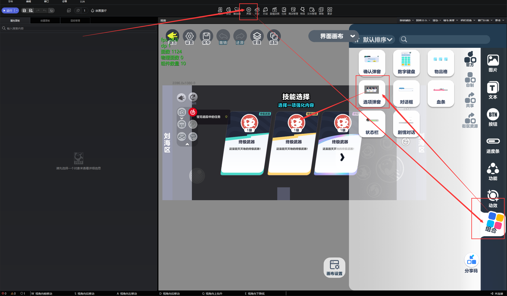
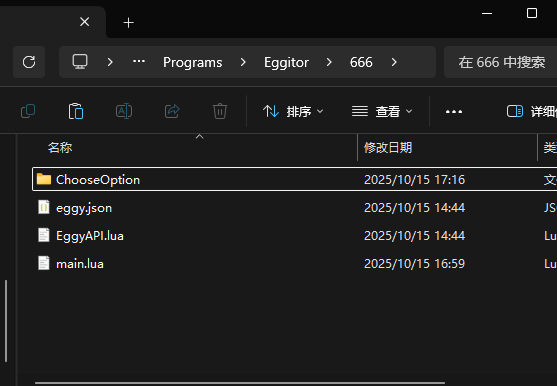

# 三选一框架

非常好三选一

# 快速开始

## 1. 在编辑器界面中，从组合将`选项弹窗`拖出到画布



## 2. 将本项目的`ChooseOption/`目录放置到项目文件夹中，就像这样



## 3. 使用示例代码参考 [`main.lua`](./main.lua)

<details>
<summary>代码参考</summary>

```lua
LuaAPI.global_register_trigger_event({ EVENT.GAME_INIT }, function()
    local ChooseOption = require "ChooseOption.__init"
    local Container = ChooseOption.build({
        choose_event = "click", --选择卡牌事件
        confirm_event = "confirm", --确认事件
        container = "1063936225", --容器ID
        description = "选择一项技能", --描述
        title = "技能选择", --标题
        confirm_button = "1130956631" --确认按钮ID
    })
    if not Container then
        return
    end
    Container:set_reward(1, function(role)
        print("奖励1")
    end)
    Container:set_reward(2, function(role)
        print("奖励2")
    end)
    Container:set_reward(3, function(role)
        print("奖励3")
    end)
    Container:set_display(1, {
        icon_description = "0级",
        icon = 14956,
        description = "六百六十六",
        title = "小丑戏法",
        label = "绿色技能",
        level = 3
    })
    Container:set_display(2, {
        icon_description = "4级",
        icon = 14228,
        description = "把你摔下去",
        title = "过肩摔",
        label = "红色技能",
        level = 2
    })
    Container:set_display(3, {
        icon_description = "2级",
        icon = 14223,
        description = "我要藏起来",
        title = "隐身技能",
        label = "紫色技能",
        level = 2
    })
    Container:show(GameAPI.get_all_valid_roles()[1]--[[@as Role]])
end)

```

</details>

<br>

# 配置项

## 容器配置项

| 字段名         | 类型     | 必填 | 描述         |
| -------------- | -------- | ---- | ------------ |
| container      | `ENode`  | YES  | 容器 ID      |
| title          | `string` | YES  | 标题         |
| description    | `string` | YES  | 描述         |
| choose_event   | `string` | YES  | 选择卡牌事件 |
| confirm_event  | `string` | YES  | 确认事件     |
| confirm_button | `ENode`  | YES  | 确认按钮 ID  |

## 卡牌UI配置项

| 字段名           | 类型        | 必填 | 描述         | 可选值            |
| ---------------- | ----------- | ---- | ------------ | ----------------- |
| icon             | `ImageKey`  | YES  | 图标预设     | -                 |
| icon_description | `string`    | NO   | 图标描述     | -                 |
| label            | `string`    | NO   | 卡牌标签文本 | -                 |
| title            | `string`    | YES  | 卡牌标题     | -                 |
| description      | `string`    | YES  | 卡牌描述     | -                 |
| level            | `CardLevel` | YES  | 卡牌等阶     | `1` \| `2` \| `3` |

# 贡献

豆油汉堡